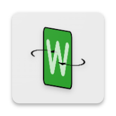

    

<h2 align="center">
    Way to Words
</h2>

![Downloads badge][downloads badge] ![Downloads badge pretty][downloads badge pretty] ![Downloads badge style][downloads badge style]

  ![Ratings badge][ratings badge] ![Ratings badge pretty][ratings badge pretty] ![Ratings badge style][ratings badge style]

Way to Wordle is a trainer app to familiarize with words to gain high score in [NYTimes Wordle](https://www.nytimes.com/games/wordle/index.html)
 
